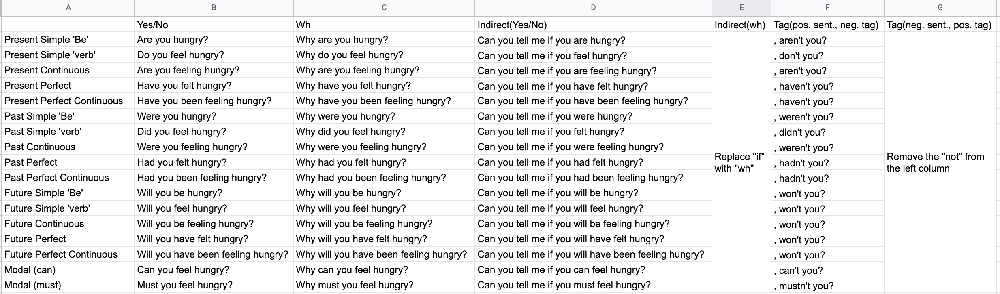

# Yes / No / Wh / Indirect / Tag

# Subject And Object

Alan kisses Julie.

- Object question: `Who does Alan kiss?`
- Subject question: `Who kisses Julie?`

John drops the pen.

- Object qusetion: `What does John drop?`
- Subject qusetion: `Who drops the pen?`

# Indefinite Nouns

- Use `they`
  - `No one cares, do they?`
  - `Everyone left, didn't they?`
  - `Someone's at the door, are they?`
- Use `it`
  - `Everything is OK, isn't it?`
  - `Noithing matters, does it?`
  - `Something smells bad, doesn't it?`

# Main verb

- `You have a cat, haven't you?` (UK)
- `You have a cat, don't you?` (US)
  
# Imperatives

- Normal
  - `Open the window, will you?`
  - `Open the window , would you?`
- To be more polite
  - `Open the window, won't you?`

# Let's

- `Let's have dinner, shall we?`

# Double Positives

- `You're getting married, are you?`
- `You've lost your wallet, have you?`

# Auxiliary Must

`We must be home now, mustn't we?`
- `Yes, we must.`
- `No, we needn't.`

# Opinions

- Normal
  - `I think it's a nice day, isn't it?`
  - `I don't think that's a good idea, is it?`
  - `You thought you'd be OK, did you?`
  - `He thinks he's going to university, does he?`
- Being sarcastic
  - `Oh, I think I'm clever, do I? Not at all.`