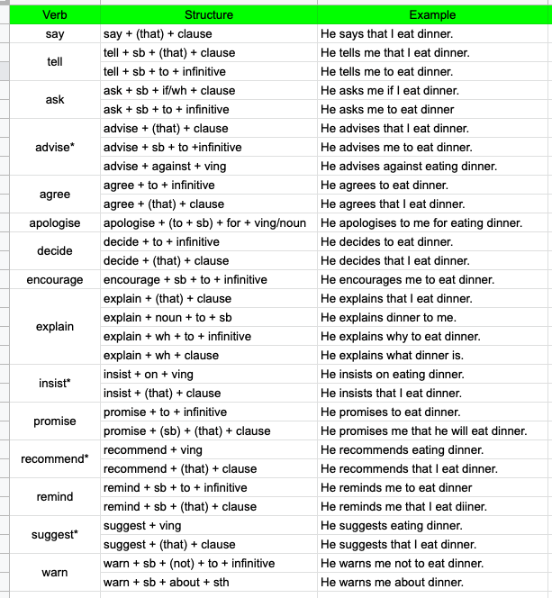

# Transitive and Intranstive Verbs

- Transtive
  - Must have an object.
    - `I like it.`
- Intranstive
  - Mustn't have an object.
  - Cannot be a passive.
    - `I arrive.`
    - `I sleep.`
- Some verbs can be both
  - `I eat.`
  - `I eat the pizza.`
- Some verbs depend on the meaning
  - `I see.` (understand)
  - `I see the mountains.` (see with eyes)

# Reporting Verbs

`*` in formal writing, verbs followed by `(that) + clause` use `infinitive` instead of `present` tense. Mostly it doesn't make ant differnce. Just a note here, don't worry about it.

- `I advise that he go to bed early` (normally `goes`)

# Stative (Static) vs Dynamic Verbs

## Stative (Static) Verbs

- Verbs that cannot be used in continuous tense.
- Verbs that aren't static are dynamic verbs.

|          |                       |                |
| -------- | --------------------- | -------------- |
| like     | know                  | belong         |
| love     | realise               | fit            |
| hate     | suppose               | contain        |
| want     | mean                  | consist        |
| need     | understand            | seem           |
| prefer   | believe               | depend         |
| agree    | remember              | matter         |
| mind     | recognise             | see            |
| own      | appear                | look (seem)    |
| sound    | taste                 | smell          |
| hear     | astonish              | deny           |
| disagree | please                | impress        |
| satisfy  | promise               | surprise       |
| doubt    | think (opinion)       | feel (opinion) |
| wish     | imagine               | concern        |
| dislike  | be                    | have           |
| deserve  | involve               | include        |
| lack     | measure (have length) | possess        |
| owe      | weigh (have weight)   |                |

- In very informal English, sometimes we hear stativ verbs are used with continuous form to express a temporary state
  - `I'm loving it.`
  - `I'm hating this movie.`

## Verbs That Are Both Stative & Dynamic

- Be
  - `you are stupid.` (usual personality)
  - `you are being stupid.` (not usual personality, only now)
- Think
  - `I think the coffee is great.` (opinion)
  - `I am thinkg about the future.` (consider)
- Have
  - `I have a car.` (own)
  - `I am having a cup of tea.` (expression)
- See
  - `I see you behind the tree.` (see with eyes)
  - `I see what you mean.` (understand)
  - `I haven't been seeing my family for days.` (have relationship)
  - `I am seeing my boss tomorrow.` (meet)
- Taste
  - `The food tastes good.` (a feeling)
  - `He is tasting the food.` (an action of tasting)

## Come / Bring / Go / Take

Movements towards the place where the speaker is.
- come
  - `Do you want to come for dinner tonight?`
- bring
  - `Remember to bring your meal when you are here.`
  - `I'll come and pick you up tomorrow. Do you want me to bring some food?`

Movement away the place where the speaker is.
- go
  - `I'll go to the supermarket later.`
- take
  - `It's about to rain. Take this umbrella with you.`