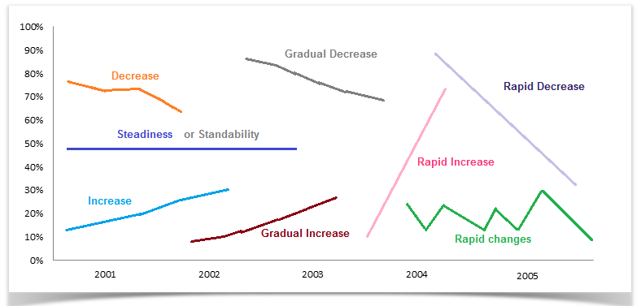

# Useful Vocabularies

- [Vocabulary For Academic IELTS Writing Task 1](https://www.ielts-mentor.com/48-ielts-vocabulary/vocabulary-for-academic-ielts-writing-task-1/528-vocabulary-for-academic-ielts-writing-task-1-part-1)

## Upward Trend

Normal degree
- rise / a rise
- increase / an increase
- climb / a climb
- grow / a growth
- go up

Stong degree
- soar / soaring
- leap / a leap
- rocket / a rocket
- surge / a surge
- boom / a boom
- skyrocket

## Downward Trend

Normal degree
- decrease / a decrease
- drop / a drop
- fall / a fall
- decline / a decline
- dip
  - `Divorce rate dipped in the 60s.`
- sink
- slip back
- go down
- slide
- tail off

Strong degree
- slump (to) / a slump
- plummet (to)
  - `Tourists to the city plummets after September.`
- plunge
- go into free-fall

## Highest Point

- peak at
- culminate
- hit a peak
- reach a peak of
  - `Our prospect is the population will reach a peak, then go back down at a similar rate.`
  - `They train, and reach a peak of physical fitness.`
- hit a high of
- an apex

## Lowest Point

- hit a low of
- the lowest mark
- the lowest point
- touch the lowest point
- rock-bottom
- rock bottom point
- bottom (at) / (the bottom / bottommost point)

## Rebounce

- bottom out
  - `The housing market has bottomed out in this part of the country.`

## Ups And Downs
- fluctuate / a fluctuation
- wave / a wave
- oscillate
  - `The stock has spent most of the past five years oscillating between $3 and $5.`
- vacillate
  - `After weeks of vacillating around $75 per barrel, the price of crude closed at $85 barrel.`
- be erratic
- rise and fall erratically
- changes sporadically
- rise and fall irregularly
- changes intermittently

## Steady
- remain steady
- remain stable
- remain unchanged
- level out / a level out
- level off / a level off
  - `Unemployment rose to ten percent and then levelled off.`
- plateau / a plateau
  - `The economic slowdown has caused our sales to plateau.`

## Degree Adjectives

Great Change
- significant
- drastic
- dramatic
- sudden
- subtantial
- sharp
- tremendous
- rapid
- considerable
- overwhelming
- enormous

Moderate Change
- gradual
- moderate
- sequential
- progressive

Slight Change
- slight
- marginal
- modest
- fractional